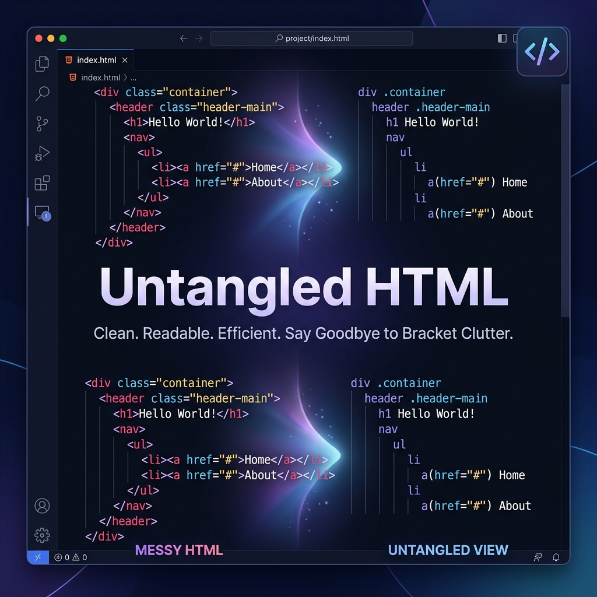

# Untangled HTML: Declutter Your Code, One Tag at a Time

<div align="center">
  
</div>

<p align="center">
  <b>Breathe life back into your code. Focus on logic, not brackets.</b>
</p>

<p align="center">
  <a href="https://marketplace.visualstudio.com/items?itemName=RahulDhole.untangled-html">
    
  </a>
</p>

<p align="center">
  
  
  
</p>

---

## 🚀 The Problem: Visual Noise
HTML can be verbose. Between `<div>`, `<span>`, and nested components in Vue/JSX, the **angle brackets (`< >`)** often create "visual noise" that makes it harder to scan the actual content and structure of your app.

## ✨ The Solution: Untangled HTML
**Untangled HTML** is a high-performance VS Code extension that gives you a "Zen Mode" for your markup. With one command, you can hide all angle brackets, leaving a clean, readable structure that feels more like Python or Stylus, while keeping your code perfectly valid.

| Feature | Standard View | Untangled View |
| :--- | :--- | :--- |
| **Clutter** | Heavy angle brackets `< > /` | Clean, focused text |
| **Readability** | Distracting syntax | Component-first focus |
| **Workflow** | Standard editing | Rapid scanning & review |

---

## 🛠 Features

- **⚡ Instant Toggle**: Switch between views instantly with a command or keybinding.
- **🎨 Theme Aware**: Automatically adjusts its color to match your VS Code theme, making hidden brackets invisible but accessible.
- **📦 Multi-Language Support**: Works seamlessly with `.html`, `.vue`, `.jsx`, and `.tsx`.
- **📊 Status Bar Integration**: See the current state (Hidden/Visible) at a glance in your bottom bar.
- **🧠 Zero Configuration**: Works out of the box. No complex settings required.

---

## 📸 See it in Action

### Before (Standard HTML)
```html
<section class="hero">
  <div class="container">
    <h1>Welcome to Untangled</h1>
    <p>Visual noise is gone.</p>
  </div>
</section>
```

### After (Untangled Mode)
```ruby
section class="hero"
  div class="container"
    h1 Welcome to Untangled h1
    p Visual noise is gone. p
  div
section
```
> **Note**: The extension only affects *visibility* in the editor. Your files remain 100% valid HTML/Vue/JSX on disk.

---

## 📦 Installation

1. Open **VS Code**.
2. Press `Ctrl+Shift+X` to open the **Extensions** view.
3. Search for **Untangled HTML**.
4. Click **Install**.

## 🎮 How to Use

1. Open any HTML, Vue, or JSX file.
2. Open the **Command Palette** (`Ctrl+Shift+P` / `Cmd+Shift+P`).
3. Type **Toggle HTML Angle Brackets** and hit enter.
4. **Tip**: Assign a shortcut (like `Ctrl+Alt+H`) for even faster toggling!

---

## 🤝 Contributing & Feedback

We love community involvement! 

- 🌟 **Like it?** [Leave a review](https://marketplace.visualstudio.com/items?itemName=RahulDhole.untangled-html&ssr=false#review) on the Marketplace.
- 🐛 **Found a bug?** [Open an Issue](https://github.com/rahuldhole/untangled-html/issues).
- 💡 **Have an idea?** Pull requests are welcome!

---

## 📜 License

Distributed under the MIT License. See `LICENSE` for more information.

<p align="center">
  Made with ❤️ by <a href="https://github.com/rahuldhole">Rahul Dhole</a>
</p>
